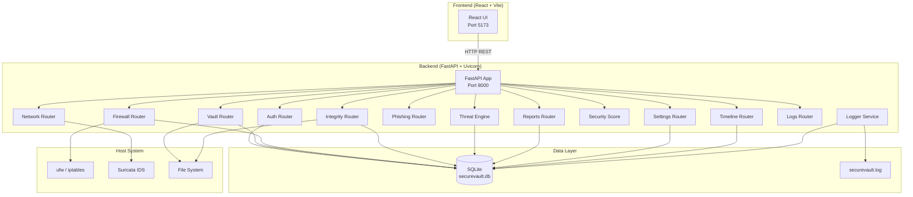

# SecureVault Architecture

## System Overview

SecureVault is a monolithic full-stack application with a clear frontend/backend separation communicating over HTTP REST APIs.



## Data Flow

### Authentication Flow
```
User → Login Form → POST /api/auth/login
  → PBKDF2 verify against users table
  → Create session token in sessions table (24h expiry)
  → Return token to frontend (stored in localStorage)
  → All subsequent requests include Authorization: Bearer <token>
```

### Vault Encryption Flow
```
User → Setup PIN (first time) → POST /api/vault/setup-pin
  → PIN hashed with PBKDF2 + random salt → stored in vault_pins table
  → Random vault_salt generated for key derivation

User → Unlock Vault → POST /api/vault/toggle
  → Verify PIN against vault_pins hash
  → derive_key(PIN, user's vault_salt) → AES-256 key held in memory

User → Encrypt File → POST /api/vault/encrypt
  → Read file → AES-256-GCM encrypt with derived key → Write .enc file
  → Delete original → Store metadata in encrypted_files table

User → Decrypt File → POST /api/vault/decrypt
  → Read .enc file → AES-256-GCM decrypt → Restore original
  → Delete .enc → Remove metadata from DB
```

### File Integrity Flow
```
User → Monitor Folder → POST /api/integrity/monitor
  → Walk directory → SHA256 hash each file
  → Store baselines in integrity_baselines table

User → Scan → POST /api/integrity/scan
  → Re-hash all baselined files
  → Compare current hash vs stored hash
  → Generate alerts: MODIFIED, DELETED, NEW
  → Store in integrity_alerts table
```

## Database Schema (10 tables)

| Table | Purpose |
|:---|:---|
| `users` | Operator credentials (PBKDF2 hashed passwords) |
| `sessions` | DB-persisted auth sessions (24h expiry) |
| `audit_logs` | System-wide event logging |
| `encrypted_files` | Vault file encryption metadata |
| `password_vault` | AES-256-GCM encrypted credentials |
| `vault_pins` | Per-user vault PIN hashes and salts |
| `firewall_rules` | Managed firewall rules |
| `firewall_status` | Firewall enabled/disabled state |
| `integrity_baselines` | SHA256 file hashes for monitored folders |
| `integrity_alerts` | Detected file integrity changes |
| `threat_recommendations` | Threat engine generated recommendations |

## Security Model

- **No plaintext secrets**: All passwords, PINs, and vault data are hashed or encrypted
- **Per-user isolation**: Each user has unique vault_salt for key derivation
- **Session expiry**: 24-hour auto-expiration with cleanup on validation
- **Graceful fallback**: System commands (ufw, suricata) fail gracefully to simulated state
- **Audit trail**: Every action is logged to both file and database
