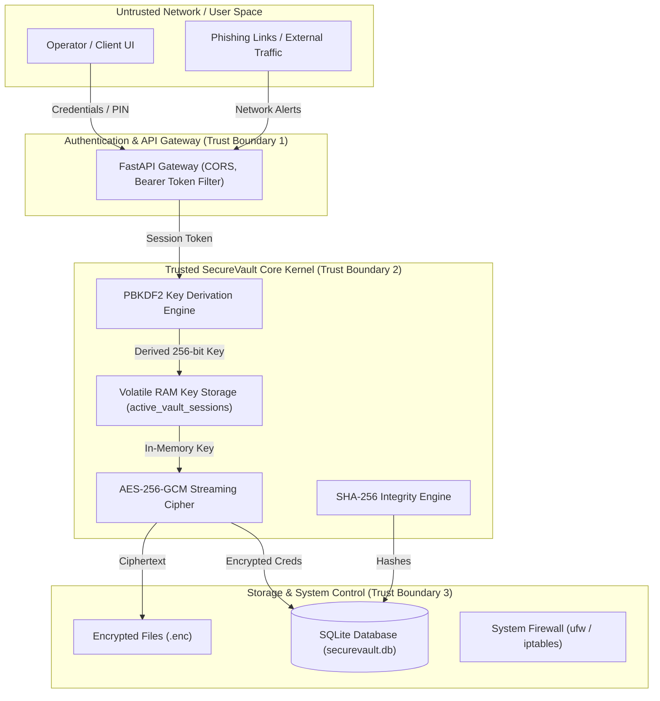

# 🛡️ SecureVault — Threat Model & Security Analysis

> [!NOTE]
> This document formalizes the threat landscape, asset boundaries, attack vectors, and cryptographic countermeasures implemented across SecureVault (CryptGuard).

---

## 1. System Assets & Sensitivity Classification

| Asset | Sensitivity Level | Description | Primary Defense Mechanism |
|:---|:---|:---|:---|
| **Master Passwords / PINs** | 🔴 Critical | User login passwords and 4-8 digit vault security PINs | PBKDF2-HMAC-SHA256 (100,000 iterations) + random 16-byte salts |
| **Vault Master Encryption Keys** | 🔴 Critical | 256-bit symmetric keys derived in-memory for AES-GCM operations | Held transiently in volatile RAM per active session; never written to disk |
| **Password Vault Credentials** | 🔴 Critical | Stored website usernames and passwords | Authenticated AES-256-GCM symmetric encryption |
| **Protected Files** | 🟠 High | Local document files encrypted by the operator | Streaming AES-256-GCM with sequence nonces (`SVSTREAM`) |
| **File Integrity Baselines** | 🟡 Medium | SHA-256 baseline checksums of monitored directories | SQLite DB + baseline hash verification scans |
| **Session Tokens** | 🟡 Medium | 64-character hex authentication tokens | DB-persisted `sessions` table with 24-hour TTL expiration |
| **Audit & Event Logs** | 🟢 Low | Application event stream & system audit records | SQLite `audit_logs` table & file logger |

---

## 2. Trust Boundaries & Data Flow Diagram

---

## 3. Threat Matrix & Countermeasures

### 3.1 Authentication & Session Hijacking

| Threat ID | Threat Vector | Risk Level | Implemented Countermeasure |
|:---|:---|:---|:---|
| **TH-AUTH-01** | Password Cracking / Brute Force | High | Passwords hashed using PBKDF2-HMAC-SHA256 with 100k iterations and unique 16-byte salts per user. Plaintext passwords are never stored or logged. |
| **TH-AUTH-02** | Stale Session Token Exploitation | Medium | Session tokens are 256-bit hex strings with 24-hour expiration stored in `sessions` table. Expired tokens are purged automatically on validation. |
| **TH-AUTH-03** | Server Restart Memory Loss | Medium | Sessions are persisted to SQLite `sessions` table rather than held in volatile dictionary memory. |

---

### 3.2 Vault & File Storage Cryptography

| Threat ID | Threat Vector | Risk Level | Implemented Countermeasure |
|:---|:---|:---|:---|
| **TH-VALT-01** | Hardcoded PIN / Shared Key | Critical | Hardcoded PINs eliminated. Each user sets a custom PIN; keys are derived using a unique 32-byte `vault_salt` stored in `vault_pins`. |
| **TH-VALT-02** | Ciphertext Tampering / Bit-Flipping | High | Encrypted using **AES-256-GCM**, which provides Galois/Counter Mode authenticated tags. Any bit tampering fails GCM verification during decryption. |
| **TH-VALT-03** | Memory Leakage on Large Payload (>1GB) | High | Large files use 32MB streaming chunking (`SVSTREAM` header) with incremental nonces (`seq.to_bytes(12, 'big')`). Verified 0.00 MB memory leakage RSS delta. |
| **TH-VALT-04** | Master Key Disk Exposure | Critical | Derived AES key is stored strictly in `active_vault_sessions` RAM dictionary and deleted immediately when the operator locks the vault. |

---

### 3.3 File Integrity & System Monitoring

| Threat ID | Threat Vector | Risk Level | Implemented Countermeasure |
|:---|:---|:---|:---|
| **TH-INTG-01** | Silent File Corruption / Ransomware Modification | High | SHA-256 hash baselining per monitored folder. Re-scanning compares current file hashes against stored baselines, flagging `MODIFIED`, `DELETED`, or `NEW` files. |
| **TH-NET-01** | Malicious Network Traffic | High | Network monitor parses Suricata IDS `eve.json` events. Threat Engine evaluates severity and generates automated firewall blocking rules (`FIREWALL_BLOCK`). |

---

## 4. Security Verification & Audit Guidelines

- **Cryptographic Audit**: Run `python tests/benchmark.py` to evaluate PBKDF2 duration, AES-256-GCM throughput, and memory RSS usage.
- **Automated Regression Suite**: Run `pytest tests/` to verify session isolation, password vault encryption, and file integrity scanning.
- **Database Backup Verification**: Run `POST /api/settings/backup` to verify snapshot integrity before executing database updates.
