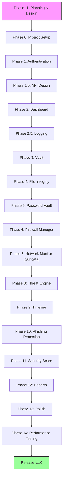

# SecureVault Development Plan

This document outlines the detailed development phases, folder structure, and testing strategy for the **SecureVault** project.

---

## High-Level Roadmap



```text
Phase -1  Planning & Design
   ↓
Phase 0   Project Setup
   ↓
Phase 1   Authentication
   ↓
Phase 1.5 API Design
   ↓
Phase 2   Dashboard
   ↓
Phase 2.5 Logging
   ↓
Phase 3   Vault
   ↓
Phase 4   File Integrity
   ↓
Phase 5   Password Vault
   ↓
Phase 6   Firewall Manager
   ↓
Phase 7   Network Monitor (Suricata)
   ↓
Phase 8   Threat Engine
   ↓
Phase 9   Timeline
   ↓
Phase 10  Phishing Protection
   ↓
Phase 11  Security Score
   ↓
Phase 12  Reports
   ↓
Phase 13  Polish
   ↓
Phase 14  Performance Testing
   ↓
Release v1.0
```

---

## Phase -1 — Planning & Design

### Goal
Establish system architecture, data flow diagrams, threat models, database schemas, and wireframes.

### Tasks
- Define system architecture (Tauri/Electron + FastAPI backend + React frontend + SQLite database).
- Create wireframes and mockups for all major views (Login, Dashboard, Vault, Firewall, Network Monitor, Settings).
- Map out database entity-relationship diagram (ERD).
- Complete Threat Model analysis for file storage and password vault.

### Verification/Test
- [ ] Review and approve architecture design documents.
- [ ] UI/UX Mockup review and validation.
- [ ] Database schema audit for security vulnerabilities.

---

## Phase 0 — Project Setup

### Goal
Create the project structure only.

### Tasks
- Create GitHub repository.
- Create README.md.
- Create project folders.
- Setup Python FastAPI.
- Setup React.
- Setup SQLite.
- Setup Tauri (or Electron later).

### Output Structure
```text
SecureVault/
├── backend/
├── frontend/
├── database/
├── docs/
├── tests/
└── README.md
```

### Verification/Test
- **Integration Test:** Can React call FastAPI?
  - *Example:* Frontend makes a `GET /` request to the Backend, which returns "Hello SecureVault".
  - If YES, proceed to the next phase.

---

## Phase 1 — Authentication

### Goal
User Login (nothing else).

### Features
- Login
- Logout
- Register
- Master Password

### Security Flow
$$\text{Password} \longrightarrow \text{Salt} \longrightarrow \text{Hash} \longrightarrow \text{Store}$$

### Database Schema
#### Users Table
- `id` (Primary Key)
- `username`
- `password_hash`
- `salt`

### Verification/Test
- [ ] Wrong password rejected.
- [ ] Correct password accepted.
- [ ] Password not stored in plain text.

---

## Phase 1.5 — API Design

### Goal
Define all backend REST API routes, schemas (Pydantic), and status codes.

### Tasks
- Document OpenAPI schema (accessible via FastAPI `/docs`).
- Create mocked endpoints for all core modules (Auth, Vault, Firewall, Network Monitor, Settings).
- Define error handling structure and common HTTP status response codes (200, 201, 400, 401, 403, 404, 500).

### Verification/Test
- [ ] API routes match the FastAPI OpenAPI document.
- [ ] Mocked endpoints respond with mock JSON payloads matching the defined schemas.

---

## Phase 2 — Dashboard

### Goal
Create the dashboard user interface only. Do not connect security components yet.

### Example UI Elements
- **Security Score:** 0%
- **Firewall:** OFF
- **Vault:** Locked
- **Files:** 0
- **Alerts:** 0

### Verification/Test
- [ ] Can dashboard open?
- [ ] Can user login and see the dashboard?

---

## Phase 2.5 — Logging

### Goal
Implement a centralized system logging mechanism on the backend, tracking system audits and application events.

### Tasks
- Implement standard logging formats (timestamps, log levels: INFO, WARNING, ERROR).
- Save security audits and event logs to the SQLite database.
- Create log files in the backend workspace (`/backend/logs/`).

### Verification/Test
- [ ] Trigger an action and verify that logs are correctly formatted in logs files and console.
- [ ] Query SQLite to ensure log events are recorded.

---

## Phase 3 — Vault Module

### Goal
First real security feature: File encryption and decryption.

### Features
- Encrypt
- Decrypt
- Lock
- Unlock

### Technology
- AES-256

### User Flow
$$\text{User clicks Encrypt File} \longrightarrow \text{Choose file} \longrightarrow \text{File encrypted} \longrightarrow \text{Saved}$$

### Verification/Test
- Small text file $\longrightarrow$ Encrypt $\longrightarrow$ Open (Cannot read) $\longrightarrow$ Decrypt $\longrightarrow$ Original file restored.

---

## Phase 4 — File Integrity Monitor

### Goal
Monitor files for unauthorized changes.

### Flow
$$\text{Choose Folder} \longrightarrow \text{Calculate SHA256} \longrightarrow \text{Save Hash} \longrightarrow \text{Wait} \longrightarrow \text{File changes?} \longrightarrow \text{Alert}$$

### Dashboard Updates
- **Files Protected:** 12
- **Modified:** 1

### Verification/Test
- Change one file $\longrightarrow$ Alert appears in the UI.

---

## Phase 5 — Password Vault

### Goal
Store website credentials securely. Everything must be encrypted.

### Database Schema
#### Vault Table
- `id` (Primary Key)
- `website`
- `username`
- `encrypted_password`

### Verification/Test
- Save password $\longrightarrow$ Restart app $\longrightarrow$ Login $\longrightarrow$ Password still available.

---

## Phase 6 — Firewall Manager

### Goal
Control the existing system firewall (do not build a new firewall).

### Features
- Enable
- Disable
- Create Rule
- Delete Rule

### Dashboard Update
- **Firewall:** ON

### Verification/Test
- Block Ping $\longrightarrow$ Ping another PC $\longrightarrow$ Blocked.

---

## Phase 7 — Network Monitor (Suricata)

### Goal
Integrate Suricata for network monitoring and parse logs.

### Flow
$$\text{Internet} \longrightarrow \text{Suricata} \longrightarrow \text{eve.json} \longrightarrow \text{Python Parser} \longrightarrow \text{Dashboard}$$

### Example Dashboard Alert
- **Alerts:** High - SQL Injection

### Verification/Test
- Trigger Suricata test alert $\longrightarrow$ Dashboard updates.

---

## Phase 8 — Threat Engine

### Goal
Implement intelligent analysis of alerts instead of just showing raw logs.

### Flow
$$\text{Suricata Alert (e.g., Possible Malware)} \longrightarrow \text{App flags as "High Risk"} \longrightarrow \text{Recommend "Terminate Process"}$$

### Dashboard Update
- **Risk:** High

### Verification/Test
- Feed fake alert $\longrightarrow$ Correct recommendation generated.

---

## Phase 9 — Timeline

### Goal
Show sequential system events in chronological order.

### Example Timeline
- **10:21** — USB Inserted
- **10:25** — Firewall Enabled
- **10:30** — File Modified
- **10:41** — Malware Alert

### Verification/Test
- Events appear in correct chronological order.

---

## Phase 10 — Phishing Protection

### Goal
Analyze URLs for phishing risks.

### Features
- Paste URL $\longrightarrow$ Analyze

### Checks
- HTTPS configuration
- Blacklists
- Typosquatting detection
- IP Address URLs

### Output Score
- **Safe:** 92% OR **Danger**

### Verification/Test
- `google.com` $\longrightarrow$ Safe
- Known phishing sample $\longrightarrow$ Danger

---

## Phase 11 — Security Score

### Goal
Combine metrics from all modules into a single dashboard security score.

### Example Weights
- **Firewall:** 20%
- **Vault:** 20%
- **Integrity:** 20%
- **Network:** 20%
- **Password:** 20%
- **Overall Score:** 86%

### Verification/Test
- Turn Firewall OFF $\longrightarrow$ Overall score decreases.

---

## Phase 12 — Reports

### Goal
Generate PDF reports summarizing system security status.

### Report Sections
- **Security Report:**
  - **Firewall:** ON
  - **Threats:** 3
  - **Files Protected:** 56
  - **Recommendations:** Update Firefox, Enable Firewall

### Verification/Test
- Generate report $\longrightarrow$ Open PDF $\longrightarrow$ Verify information is correct.

---

## Phase 13 — Polish

### Tasks
- Dark Theme
- Animations
- Icons
- Charts
- Settings
- Notifications
- Auto Update
- Backup
- Restore

---

## Phase 14 — Performance Testing

### Goal
Verify database, UI, and encryption algorithms handle stress loads smoothly.

### Tasks
- Benchmark AES-256 encryption on large files (e.g., >500 MB) for speed and memory leakage.
- Stress-test the database under multiple concurrent writes/reads.
- Ensure the UI maintains 60 FPS under intensive event stream updates from the Network Monitor.

### Verification/Test
- [ ] Measure CPU/Memory usage under load; confirm it conforms to performance targets.
- [ ] Validate that encrypting files larger than 1GB does not crash the application.

---

## Release v1.0

### Goal
Prepare build assets and installers for deployment.

### Tasks
- Compile code for production architectures.
- Create installers for Tauri (or Electron).
- Complete final manual end-to-end security audits.

### Verification/Test
- [ ] Clean install on target machine successfully starts and functions.

---

## Folder Structure

The project directory structure should be organized as follows:

```text
SecureVault/
├── backend/
│   ├── auth/
│   ├── vault/
│   ├── firewall/
│   ├── integrity/
│   ├── phishing/
│   ├── network/
│   ├── alerts/
│   └── reports/
├── frontend/
│   ├── dashboard/
│   ├── login/
│   ├── settings/
│   └── vault/
├── database/
├── tests/
└── docs/
```

---

## Testing Strategy (After Every Phase)

Do not wait until the end. After every feature, run four simple tests:

| Test Type | Description & Example |
| :--- | :--- |
| **Functional Test** | Does the feature work as expected? |
| **Security Test** | Is sensitive data protected (e.g., passwords encrypted/hashed)? |
| **Edge Case Test** | What happens with empty input, very large files, or invalid data? |
| **Regression Test** | Did this new feature accidentally break something that worked before? |
